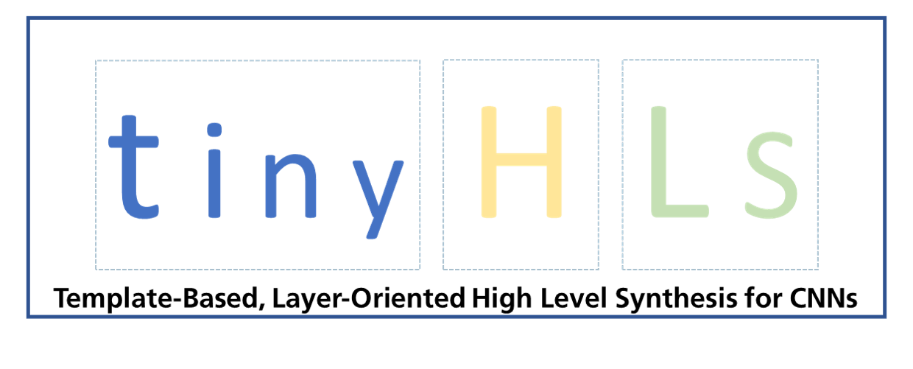

[](https://www.ims.fraunhofer.de/en.html)
[](https://github.com/Fraunhofer-IMS/tinyHLS/actions/workflows/main.yml)
[](LICENSE)
[](https://doi.org/10.5281/zenodo.13785841)


# TinyHLS

**tinyHLS** is a compact hardware compiler developed by Fraunhofer IMS. It processes tensorflow.keras
neural networks and translates them into a dedicated co-processor unit. The generated outputs are platform
independent and consist entirely of synthesizable Verilog HDL code. The co-processor is wrapped with a
[AHB-lite interface](output/tinyHLS_AHB_interface.v) to allow easy integration into custom processor systems.


## Features

tinyHLS currently supports the following layers:

 - conv1D
 - maxpool1D
 - globalaveragepool1D
 - dense
 - linear and ReLU activation functions can be implemented

The conv1D layer is configurable either as a resource-efficient or as performance-optimized version.

> [!NOTE]
> tinyHLS is under active development and will be expanded with more features.
> Contributions and feedback are highly welcome!

## Quickstart 

### Conda Installation

It is recommended to use the framework in a [conda](https://docs.conda.io/en/latest/) environment.
To setup the environment and activate it, the following commands have to be run after cloning the repository:

```
$ conda env create -f environment.yml
$ conda activate tinyHLS
```


### Usage

A model can be trained or loaded using the standard workflow in Python TensorFlow Keras.
The first part of the translation process is, to convert the weights of the user CNN into Verilog
includes by running the following commands:

```
tinyhls.extract_weights()
tinyhls.convert_weights_to_hex()
tinyhls.create_verilog_includes()
```

Second, the model is translated into HDL and a testbench with examplary values generated by the following commands 

```
tinyhls.translate_model()
tinyhls.create_testbench()
```

### Examples

An example of a small CNN is provided in the [`test.py`](test.py) file.
This example is also executed by the project's [GitHub actions workflow](https://github.com/Fraunhofer-IMS/tinyHLS/actions).

> [!TIP]
> See the action's artifacts for tool logs and the generated HDL example.

Further examples are provided under [examples/](https://github.com/Fraunhofer-IMS/tinyHLS/examples), which include the application on PPG and ECG biosignals using public datasets as well as a workaround to use this tool in combination with PyTorch. More details are provided in the userguide. 

### Simulation

The generated Verilog code can be simulated using any open-source or commercial HDL simulator tools.
The GitHub actions workflow of this project uses Icarus Verilog as open-source simulation example.
The according simulation scripts can be found in the [`ci`](.ci) folder.


### Requirements

Please see [`environment.yml`](environment.yml) for a detailed list of python packages. If you want to use the Icarus simulator, you can find details about the version and installation in the project's [GitHub actions workflow](https://github.com/Fraunhofer-IMS/tinyHLS/actions).

### License 
This project is provided under the [GPL-3.0 license](LICENSE). A special exception was included, that applies particularly for the outputs of the framework. The exception is: 

```
As a special exception, you may create a larger work that contains
part or all of the tinyHLS hardware compiler and distribute that 
work under the terms of your choice, so long as that work is not 
itself a hardware compiler or template-based code generator or a 
modified version thereof. Alternatively, if you modify or re-
distribute the hardware compiler itself, you may (at your option) 
remove this special exception, which will cause the hardware compi-
ler and the resulting output files to be licensed under the GNU 
General Public License Version 3 without this special exception.

```


## Contact

Fraunhofer Institute for Microelectronic Circuits and Systems, Duisburg, Germany

- Homepage: [ims.fraunhofer.de/en.html](https://www.ims.fraunhofer.de/en.html)
- Project maintainer: [Ingo Hoyer](mailto:ingo.hoyer@ims.fraunhofer.de)
- Contact for questions regarding license and exploitation: [tinyHLS support](mailto:tinyHLS@ims.fraunhofer.de) 
